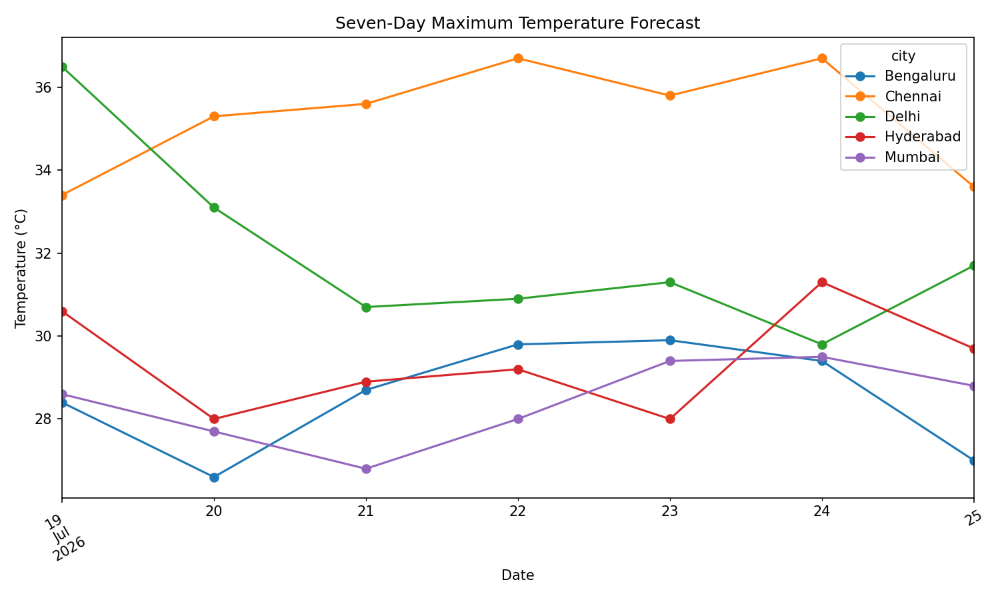
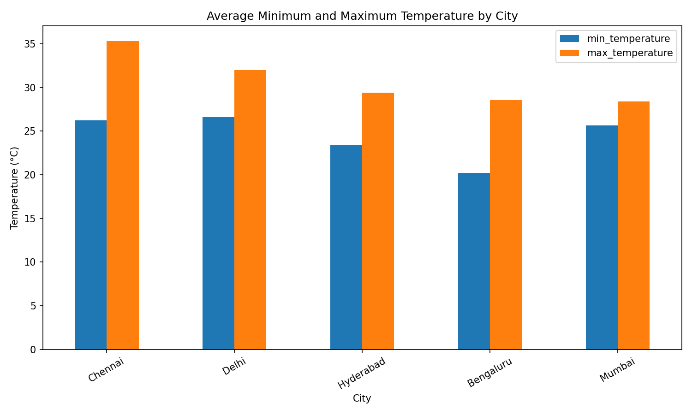
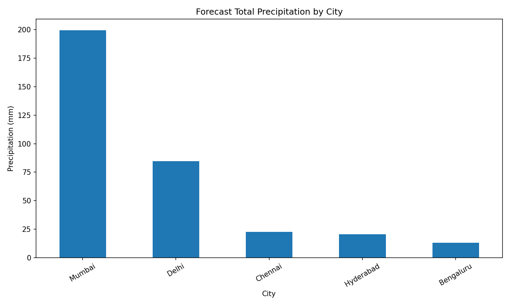
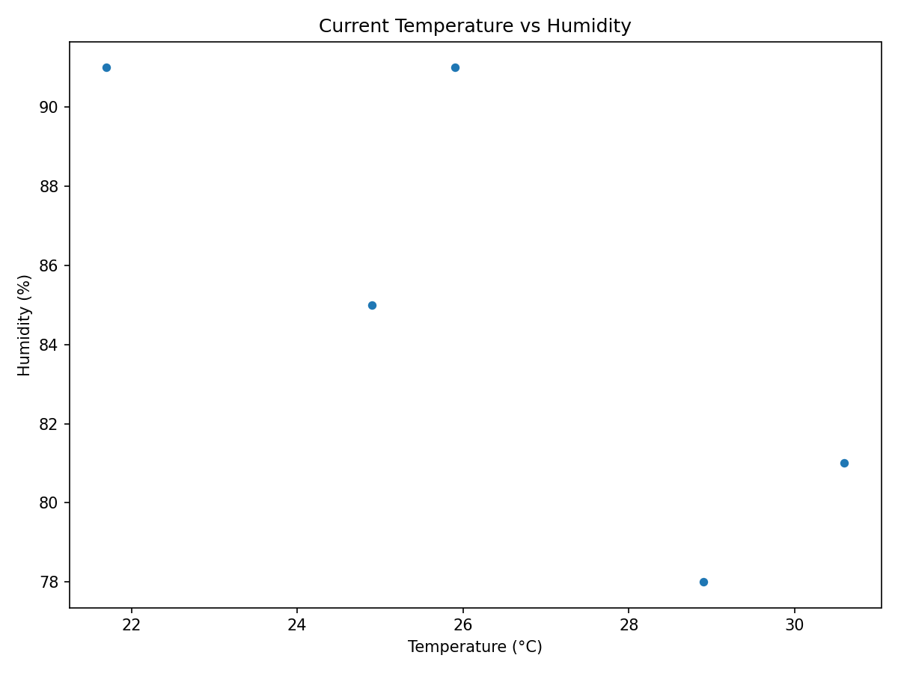

# Weather FAQ Report

## 1. What is the current weather in each city?

- **Bengaluru**: 21.7°C, Light drizzle, humidity 91%, wind 12.3 km/h.
- **Chennai**: 28.9°C, Overcast, humidity 78%, wind 9.0 km/h.
- **Hyderabad**: 24.9°C, Moderate drizzle, humidity 85%, wind 13.9 km/h.
- **Mumbai**: 25.9°C, Slight rain showers, humidity 91%, wind 14.3 km/h.
- **Delhi**: 30.6°C, Overcast, humidity 81%, wind 8.1 km/h.

## 2. Which city/date has the highest forecast temperature?

**Chennai** on 2026-07-22 with **36.7°C**.

## 3. Which city/date has the lowest forecast temperature?

**Bengaluru** on 2026-07-23 with **19.9°C**.

## 4. Which city has the most forecast precipitation?

**Mumbai**, with a seven-day total of **199.4 mm**.

## 5. Where is the strongest forecast wind?

**Mumbai** on 2026-07-23, reaching **27.6 km/h**.

## 6. What is the most common forecast condition?

**Light drizzle**.

## 7. Is temperature related to humidity?

Use the scatter plot below. A downward pattern suggests that humidity decreases as temperature rises; an upward pattern suggests the opposite. More historical records are needed for a reliable conclusion.

